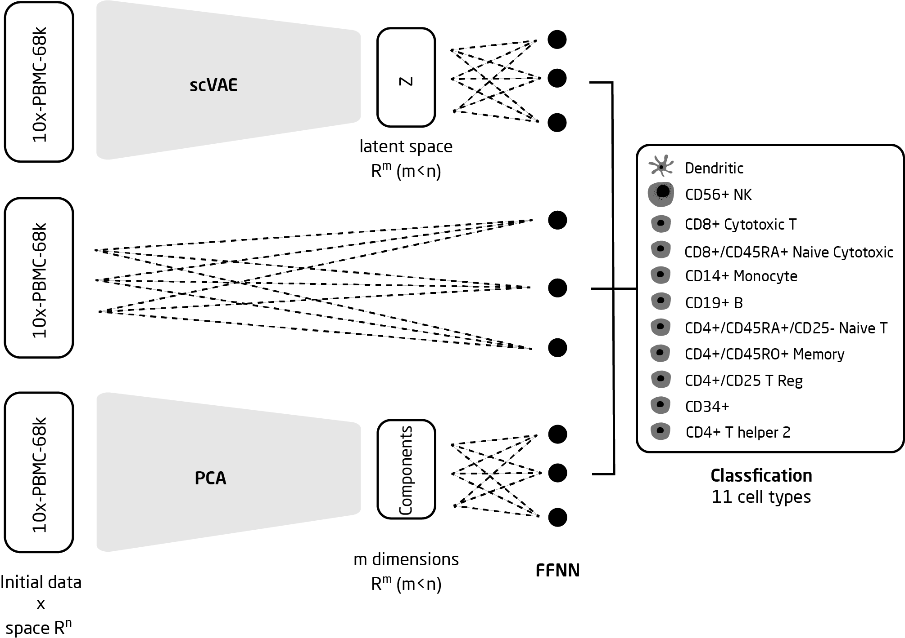

# EXPLORING VARIATIONAL AUTOENCODERS POTENTIAL TO CLASSIFY SINGLE-CELL RNA-SEQ DATA

*[Begoña Bolos Sierra](mailto:193036@student.dtu.dk) (s193036), [Felix Pacheco Pastor](mailto:fepac@biosustain.dtu.dk) (s192496), [Paula Rodriguez](mailto:s192448@student.dtu.dk) (s192448), [Laura Sans-Comerma](mailto:laurasansc@gmail.com) (s192437)*

02456 - Deep Learning. DTU Bioinformatics, Technical University of Denmark. 

## Project workflow

